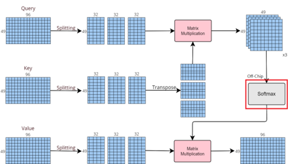

# Matrix Accelerator for Vision Transformer (ViT)

## Project Overview
This is a personal record of the hardware accelerator design for **Vision Transformer (ViT)**, developed during my undergraduate studies in the **Honors Program of Electrical Engineering and Computer Science (EECS)**, specialized in the **Department of Electronic Engineering**, at **National Taipei University of Technology (NTUT)**. The design focuses on optimizing matrix computations (QKV splitting and multiplications) using an efficient RTL architecture.

## Technical Specs
* **Process**: TSMC 180nm CMOS.
* **Core Design**: 
    * RTL architecture for matrix operations.
    * High-performance multiplier units with fixed-point optimization.
* **Implementation**: Targeted for 180nm cell-based flow.

## Documentation & Architecture

*Detailed architecture based on the "Matrix Accelerator Designed for Vision Transformer" publication.*

## Hardware Implementation Details

### 1. Image Splitting & Processing Flow (Data Tiling)
To optimize hardware resource utilization, the architecture employs an **Image Splitting** strategy (also known as **Data Tiling**). The **49x96** pixel input is partitioned into three **49x32** sub-blocks. This tiling strategy allows the hardware to process the Attention mechanism sequentially, effectively reducing the on-chip memory requirement:

$$Attention(Q, K, V) = softmax(\frac{QK^T}{\sqrt{d_k}})V$$

### 2. Fixed-point Arithmetic (Q4.8)
The design employs **Fixed-point Arithmetic** to achieve high throughput with low power consumption on process. 
* **Data Format**: 12-bit Binary (Q4.8).
    * **Integer Part**: 4 bits.
    * **Fractional Part**: 8 bits.
* **Multiplication & Precision Control**:
    * Multiplying two 12-bit values results in a **24-bit** intermediate product.
    * **Bit Truncation**: To maintain the Q4.8 format, the design discards the **upper 4 bits** and **lower 8 bits** of the 24-bit product.
    * **Rounding Logic**: Implemented **Rounding to nearest (Half up)** to minimize quantization errors and maintain inference accuracy.

## Repository Structure
* **main branch**: Core RTL (`transformer.v`) and Testbench (`testfixture.v`).
* **pattern branch**: Full simulation patterns and I/O data (`/pattern`).

## Publication Reference
This design corresponds to the following paper:
* "[Matrix Accelerator Designed for Vision Transformer](https://ieeexplore.ieee.org/document/10773711)," *2024 IEEE International Conference on Consumer Electronics-Asia (ICCE-Asia)*.
